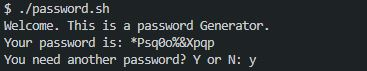

# Password Generator 🔐

Hi! 😎👋🏿

This is a password generator script built with bash. 

## Project Overview
A password generator is a tool that generates a strong and unique password. The password generator can specify the length of the password and the types of characters to include. 

The program can include uppercase and lowercase letters, numbers, and special characters. The password generator can use a random number generator to create a unique and unpredictable password. 

A strong password should be at least 12 characters long and should include a mix of uppercase and lowercase letters, numbers, and special characters.

## Project View

## Credits
This project idea was generated by chatGPT

